# 📄 Newel RAG — Local Document Q&A with Retrieval-Augmented Generation

A production-ready, local **Retrieval-Augmented Generation (RAG)** system that lets you ask natural-language questions about any PDF document and get precise, citation-backed answers — powered by **LLaMA 3.3 70B**, **HuggingFace Embeddings**, **ChromaDB**, and a **BGE Reranker** for two-stage retrieval.

---

## ✨ Features

| Feature | Details |
|---|---|
| **PDF Ingestion** | Extracts text from any PDF using PyMuPDF with full page-number tracking |
| **Chunked Embeddings** | Splits documents into 1 000-token chunks (200-token overlap) for dense retrieval |
| **Vector Store** | Persists embeddings in ChromaDB — no re-ingestion needed on restart |
| **Two-Stage Retrieval** | Over-fetches 15 candidates via vector search, then reranks with `BAAI/bge-reranker-v2-m3` to surface the top 6 |
| **LLM Answering** | Uses Groq's blazing-fast `llama-3.3-70b-versatile` for answer generation |
| **Inline Citations** | Every claim in the answer includes `[Page X]` references back to the source PDF |
| **Anti-Hallucination** | Strict system prompt ensures the model only uses provided context — never internal knowledge |
| **Interactive CLI** | Simple question-answer loop right in your terminal |

---

## 🏗️ Architecture

```mermaid
flowchart LR
    subgraph Ingestion [DOCUMENT INGESTION PIPELINE]
        direction LR
        Doc[📄 PDF Document] -- extract text --> Loader[📄 PyMuPDF Loader]
        Loader -- raw text --> Splitter[✂️ Text Splitter]
        Splitter -- chunks --> Embed1[🧠 HuggingFace Embeddings]
    end

    subgraph VS [VECTOR STORE]
        DB[(🗄️ ChromaDB<br>Vector Store)]
    end
    
    Embed1 -- store vectors --> DB

    subgraph QA [QUERY AND ANSWER PIPELINE]
        direction LR
        User[👤 User Question]
        Embed2[🧠 HuggingFace Embeddings]
        Search((🔍 Similarity Search))
        Rerank[🔽 BGE Reranker]
        Chunks[📚 Top 6 Chunks]
        Builder[📝 Prompt Builder]

        User -- embed query --> Embed2
        Embed2 --> Search
        Search -- candidates --> Rerank
        Rerank -- rerank --> Chunks
        Chunks -- context --> Builder
        User -- question --> Builder
    end

    Search -- retrieve top 15 --> DB
    DB --> Search

    subgraph LLM_Node [LLM]
        LLM_Model[⚡ Groq LLaMA 3.3 70B<br>or Local Ollama]
    end

    subgraph Answer_Node [ANSWER]
        FinalAnswer(((✔️ Answer with<br>Citations)))
    end

    Builder -- prompt --> LLM_Model
    LLM_Model -- response --> FinalAnswer

    %% Styling
    classDef default fill:#1e1e1e,stroke:#fff,stroke-width:1px,color:#fff;
    classDef container fill:#000000,stroke:#555,stroke-width:1px,color:#fff;
    
    class Ingestion,VS,QA,LLM_Node,Answer_Node container;
```



---

## 📂 Project Structure

```
deepseek/
├── main.py              # CLI entry point (Groq API)
├── main_ollama.py       # CLI entry point (Local Ollama model)
├── rag_utility.py       # Core RAG pipeline for Groq
├── rag_utility_ollama.py# Core RAG pipeline for local Ollama
├── requirements.txt     # Python dependencies
├── .env                 # Groq API key 
├── .gitignore           # Ignores venv, vectorstore, PDFs, .env
├── doc_vectorstore/     # Auto-generated ChromaDB persistence directory
└── venv/                # Python virtual environment
```

---

## 🚀 Getting Started

### Prerequisites

- **Python 3.10+**
- A **Groq API key** — get one free at [console.groq.com](https://console.groq.com)

### 1. Clone the repository

```bash
git clone https://github.com/Dhruvp18/Newel_Rag.git
cd Newel_Rag/deepseek
```

### 2. Create and activate a virtual environment

```bash
python -m venv venv

# Windows
venv\Scripts\activate

# macOS / Linux
source venv/bin/activate
```

### 3. Install dependencies

```bash
pip install -r requirements.txt
```

### 4. Set up your environment variables

Create a `.env` file in the project root:

```env
GROQ_API_KEY="gsk_your_groq_api_key_here"
```

### 5. Run the application

```bash
# Ingest the default PDF and start Q&A (Groq)
python main.py

# Ingest and start Q&A with Local Ollama
python main_ollama.py

# Ingest a specific PDF
python main.py --ingest path/to/your-document.pdf

# Force re-ingestion of an already-ingested document
python main.py --force-ingest
```

---

## 💬 Usage

Once running, you'll see an interactive prompt:

```
Type your question (or 'quit', 'exit' to leave):

Q: What was Swiggy's total revenue in FY 2023-24?
Thinking...

A: According to the annual report, Swiggy's total revenue for FY 2023-24 was ₹11,247 crores [Page 42].
   This represents a year-over-year growth of 31.4% compared to FY 2022-23 [Page 43].

   Sources: Page 42, Page 43
```

Type `quit`, `exit`, or `q` to leave the Q&A loop.

---

## ⚙️ CLI Flags

| Flag | Description |
|---|---|
| `--ingest <file>` | Path to a PDF file to ingest into the vector store |
| `--force-ingest` | Re-ingest the default PDF even if a vector store already exists |

---

## 🔧 Key Components

### `rag_utility.py` & `rag_utility_ollama.py`

| Function | Description |
|---|---|
| `process_document_to_chroma_db(file_name)` | Loads a PDF via PyMuPDF, splits it into 1 000-char chunks with 200-char overlap, embeds with HuggingFace, and persists to ChromaDB |
| `answer_question(user_question)` | Performs two-stage retrieval (vector search → BGE rerank), builds a cited context, and queries Groq LLaMA (or local Ollama) for a grounded answer |

### Models Used

| Model | Purpose | Provider |
|---|---|---|
| `all-MiniLM-L6-v2` | Document & query embedding | HuggingFace (local) |
| `BAAI/bge-reranker-v2-m3` | Cross-encoder reranking | HuggingFace (local) |
| `llama-3.3-70b-versatile` | Answer generation (Cloud) | Groq (cloud API) |
| `llama3` | Answer generation (Local) | Ollama (local) |

---

## 📦 Dependencies

```
langchain-community        # Document loaders & community integrations
langchain                  # Core LangChain framework
langchain-huggingface      # HuggingFace embeddings integration
langchain-text-splitters   # Recursive text chunking
langchain-chroma           # ChromaDB vector store
langchain-groq             # Groq LLM integration
unstructured[pdf]          # PDF parsing utilities
sentence-transformers      # BGE reranker model
python-dotenv              # .env file loading
```

---

## 🛡️ Anti-Hallucination Guardrails

The system prompt enforces strict grounding rules:

1. **Context-only answers** — the LLM can only use the retrieved document chunks
2. **Mandatory citations** — every claim must include `[Page X]` references
3. **Explicit refusal** — if the answer isn't in the context, the model says so instead of guessing
4. **Exact quoting** — financial figures are quoted verbatim from the source

---

## 📜 License

This project is for educational and research purposes.

---

## 🙏 Acknowledgements

- [LangChain](https://github.com/langchain-ai/langchain) — RAG orchestration
- [Ollama](https://ollama.com) — local LLM runners
- [Groq](https://groq.com) — lightning-fast LLM inference
- [ChromaDB](https://www.trychroma.com) — vector storage
- [HuggingFace](https://huggingface.co) — embeddings & reranker models
- [PyMuPDF](https://pymupdf.readthedocs.io) — PDF text extraction
